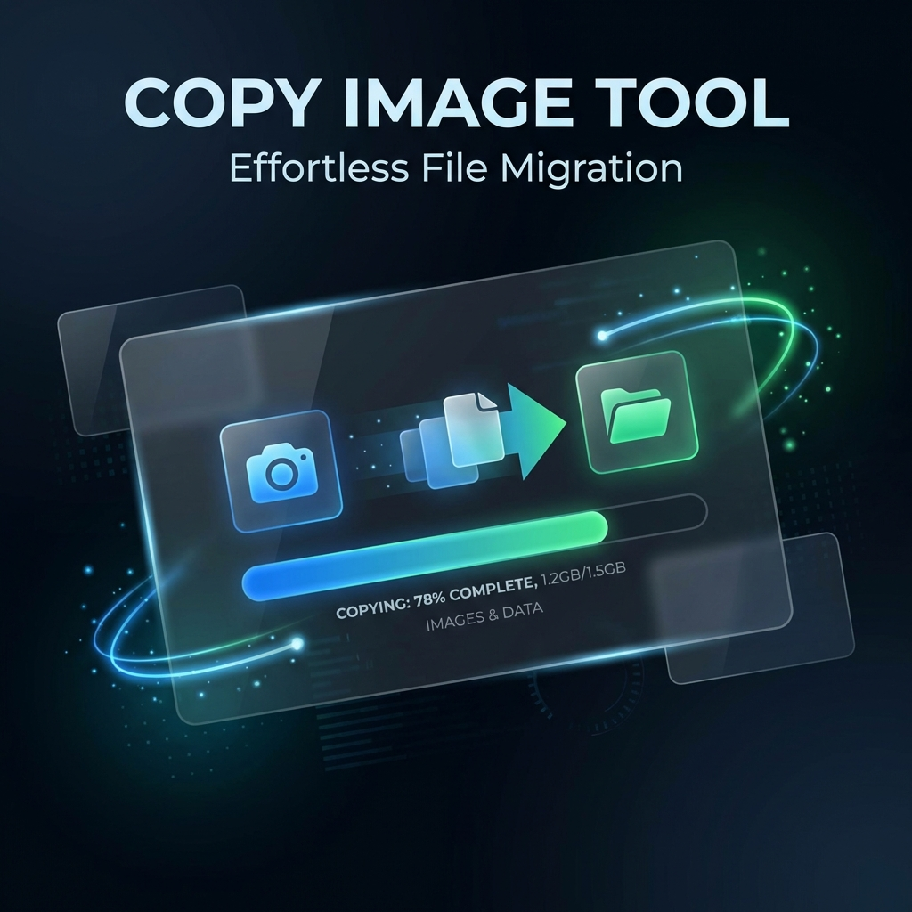
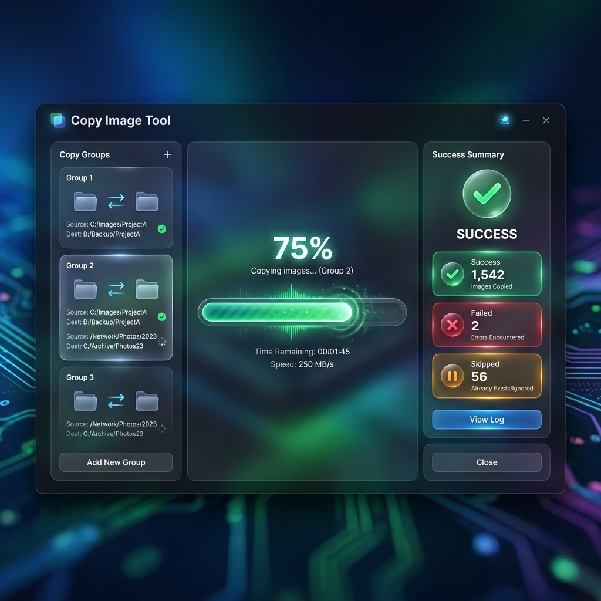

<p align="center">
  
</p>

# Copy Image Tool 📷

<p align="center">
  
  
  
  
</p>

<p align="center">
  <strong>Effortless, high-speed bulk image migration for professionals.</strong><br>
  Available as a modern <strong>Desktop GUI</strong> and a powerful <strong>CLI</strong>.<br><br>
  🎓 <strong><a href="./learning.md">New to Go? Check out our Learning Guide!</a></strong>
</p>

---

## 🌟 Why Copy Image Tool?

Copy Image Tool is designed for high-performance file orchestration. Whether you are managing product catalogs with thousands of images or distributing assets across multiple network shares, this tool ensures speed, reliability, and precision.

### ✨ Key Highlights

*   ⚡ **Performance First**: Built with Go's legendary concurrency for blazing-fast parallel copying.
*   🖥️ **Premium Desktop Experience**: A state-of-the-art GUI built with Wails, featuring glassmorphism and real-time status updates.
*   📂 **Smart Copy Groups (Beta)**: Unique feature to map one source to multiple destinations with individual settings.
*   🌐 **Network Native**: First-class support for UNC paths and complex network share environments.
*   🔄 **Bulletproof Updates**: Integrated auto-update system keeps you on the latest version effortlessly.

---

## 🖼️ Screenshots

<p align="center">
  
</p>

---

## 🚀 Features at a Glance

### 🖥️ Desktop Application (Wails)
- **Modern Dark Theme**: Eye-pleasing premium dark mode interface.
- **Native OS Dialogs**: Integrated folder pickers for a seamless experience.
- **Interactive Progress**: Real-time animated progress bars with per-file details.
- **Toast Notifications**: Get notified instantly on successes or errors.
- **Live Settings**: Adjust workers, extensions, and retry logic on the fly.

### ⌨️ Command Line Interface
- **Headless Power**: Perfect for automation scripts and server environments.
- **Interactive Menu**: Quick-access interactive terminal interface.
- **Dry-Run Mode**: Preview your migration before moving a single byte.
- **Robust Retries**: Exponential backoff ensures transient network issues don't stop your work.

---

## 🛠️ Built With

<p align="left">
  
  
  
  
  
</p>

---

## � Installation & Setup

### Requirements
- **Go**: v1.23 or higher
- **Desktop App**: Windows 10/11 (WebView2 required)

### Fast Install
Download the latest binaries directly from our [Releases Page](https://github.com/hoangtran1411/copy-image/releases).

### Build from Source
```bash
# Clone the repository
git clone https://github.com/hoangtran1411/copy-image.git
cd copy-image

# install dependencies
go mod tidy

# Build CLI
make build

# Build Desktop App (Windows)
wails build -clean
```

---

## 📖 Quick Start

### Running the Desktop App
Simply run `copyimage-desktop-windows-amd64.exe` to launch the GUI.

### Using the CLI

#### Windows
```powershell
# Interactive mode (Recommended)
./copyimage-cli.exe

# Command line mode (Automation)
./copyimage-cli.exe --source "C:\Photos" --dest "D:\Backup" --overwrite --workers 12
```

#### Linux / macOS
```bash
# Interactive mode
./copyimage-cli

# Command line mode
./copyimage-cli --source "/media/data/images" --dest "/media/backup/images" --overwrite --workers 12
```

---

## ⚙️ Configuration (`config.yaml`)

```yaml
# Global settings
workers: 10
extensions: [.jpg, .png, .gif]
max_retries: 3
dry_run: false

# Copy Groups (BETA)
groups:
  - id: "catalog-sync"
    name: "Sync Product Catalog"
    source: "\\\\server-a\\images"
    enabled: true
    destinations:
      - { path: "\\\\server-b\\public", overwrite: true, enabled: true }
      - { path: "D:\\LocalArchive", overwrite: false, enabled: true }
```

---

## 🤝 Contribution

We welcome all contributions! Whether it's fixing bugs, improving documentation, or suggesting new features.

Please read our [CONTRIBUTING.md](CONTRIBUTING.md) to get started.

---

## 📜 License

Distributed under the **MIT License**. See `LICENSE` for more information.

---

<p align="center">
  Made with ❤️ by <a href="https://github.com/hoangtran1411">Hoang Tran</a>
</p>
